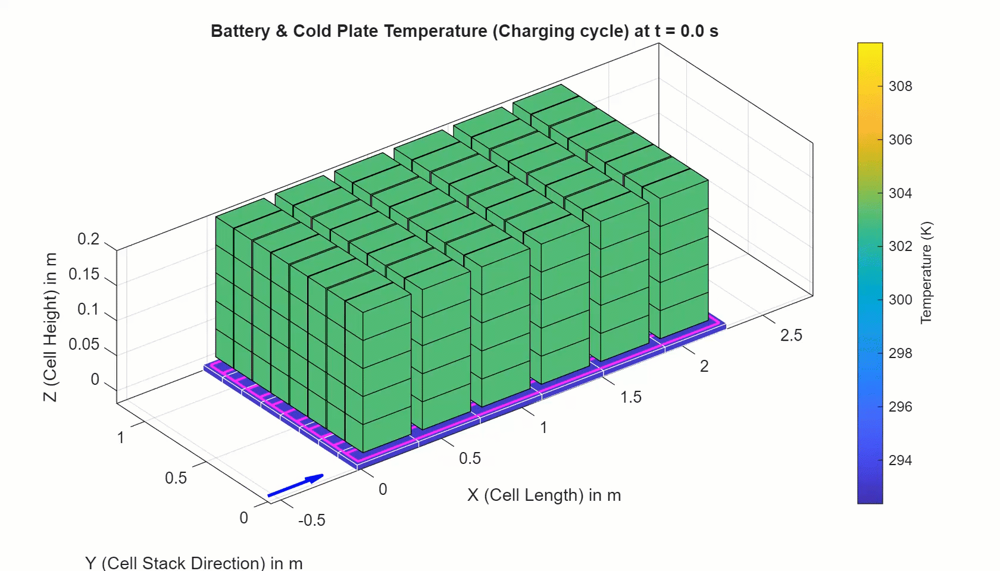
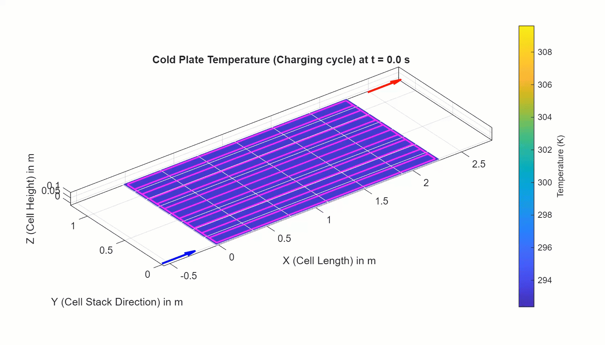

# Battery Cooling Plate Design with Simscape

 
 
<table>
  <tr>
    <td class="text-column" width=1200> This project helps you learn how to 
use Simscape Battery&trade; to design a battery pack with thermal 
considerations. A battery pack contains multiple cells in series and 
parallel, and these cells generate heat. All cells must be cooled uniformly 
so that the temperature difference across the pack remains small. Uniform 
cell temperatures help reduce cell degradation variation and support robust 
control by the battery management system (BMS). 
    </td>
  </tr>
</table>

<table>
  <tr>
    <td class="text-column" width=1200></td>
  </tr>
</table>

<table>
  <tr>
    <td class="image-column" width=400></td>
    <td class="image-column" width=400></td>
    <td class="image-column" width=400></td>
  </tr>
</table>

<table>
  <tr>
    <td class="text-column" width=1200></td>
  </tr>
</table>

<table>
  <tr>
    <td class="text-column" width=1200>This project provides workflows for 
designing, modeling, simulating, and performing thermal analysis of a 
battery pack with detailed cooling plate using MATLAB&reg; and 
Simscape&trade;. There are four steps involved in the design process:

1) Build a battery pack in the Battery Builder app with spatial thermal discretization for each cell.
2) Generate a cooling plate component based on your flow channel design.
3) Run simulation for the battery pack with detailed cooling plate.
4) Analyze the thermal repsonse of the pack under various loading conditions.

These steps are automated, enabling rapid design iteration and faster pack 
development.
    </td>
  </tr>
</table>
 

## To Get Started 
* Clone the project repository.
* Open BatteryCoolingPlateSimscape.prj to get started with the project. 
* Requires MATLAB&reg; release R2025a or newer.
 

Copyright 2025 - 2026 The MathWorks, Inc.
